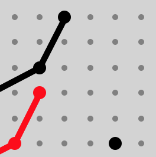

TwixT tactics Guide
===

Introduction and motivation (you can safely skip this)
---
In the mid 70s my parents were just married and the oil crisis struck, creating the "autoloze zondagen" (car-less Sundays; to reduce gas consumption). At that time, 3M published 2 games, which my parents bought: Twixt and Acquire. At about 10 years of age (mid 80s), my father taught me TwixT: explaining the basic rules, beating me in the game and explaining his tactics. We didn't play it that much (as far as I remember), but I have some very good memories of rainy winter Sunday's playing with my dad. 

In the next 30 years, I occasionally played Twixt against a newcomer to the game, which always was in my opinion always an easy win. Now that my own son is 9 years old, I picked up the game, discovered [the TwixT puzzles online](http://www.ibiblio.org/twixtpuzzles/), played several games on [TwixT Live](https://twixtlive.com) and on [Little Golem](https://www.littlegolem.net). I contributed to [Twixtbot-ui](https://github.com/stevens68/twixtbot-ui), a graphical user interface on top of [twixtbot](https://github.com/BonyJordan/twixtbot). Based on the games played, I discovered tractical patterns that emerged in  In the following section, I share those patterns with you, in the hope that they contribute to your interest and enjoymen for the game of TwixT.

One final word about the setup of this tactics guide. I've deliberately tried to keep information as condense and structured as possible. Please feel free to contribute and extend the tactics guide, but keep information as bare-bones as possible.

Definitions
---

Word | Description
---|---
Peg|The pin that is placed by a player on each turn.
Link|Connection between two pegs.
 

Tactic 1: The Setup (offensive)
---
A setup is a positioning of 2 of your own pegs that can be connected in one or two moves (setups wich require three moves are often combinations of two chained single move setups). Frequent setups have names and are identified by the relative distance between the two pegs (largest distance first). Common setups are:

Name|Positioning|Hamming distance|# moves|# connections|weak spot|example
---|---|---|---|---|---|---
Beam|4, 0|4|1|2|Hammer attack|
Tilt|3, 3|6|1|2|Hammer attack|
Short|1, 1|2|1|2|None particular|
Mesh|2, 0|2|1|2|None particular|
Coign|3, 1|4|1|2|Hammer attack (depending board position)|
Long|4, 2|6|1|1|See note 3. below the table|
5,2|5,2|7|2|6|Practically none|
5,0|5,0|5|2|6|None particular|
4,4
3,0
6,1
5,4

Notes:

1. Setups can be rotated and mirrored, resulting in 4 or simetimes 8 variants.
1. There is often a tradeoff between the distance a setup covers and the number of connections that can be mabe between the two pegs.
1. The Long setup could be attacked by the opponent by placing a peg in the one position that connects the setup. You can counter that by placing a peg next to that peg, creating a chain of a coign and a short setup. This defensive reply is often successfull if no other influencing pegs are nearby.

Tactic 2: The Hammer (offensive)
---
Placing a peg next to the other player's peg, often permedicular to the direction the other player is going or perpedicular to the setup of the other player.

In the example, black (playing left-to-right) has chained a beam setup with a tilt setup, leaving the single black peg in the middle vulnerable to a hammer attack.

Tactic 3: Hammer defence (defensive)
---
Two options: offensive: pass the hammer; defensive: away from the hammer

Tactic 4: Parallel setup defense (defensive)
---

References
---

- http://gambiter.com/connection/TwixT.html
- Article from gamers magazine
- ...