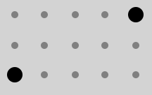

# TwixT tactics Guide

## Introduction and motivation (you can safely skip this)
In the mid 70s my parents were just married and the oil crisis struck, creating the "autoloze zondagen" (car-less Sundays; to reduce gas consumption). At that time, 3M published 2 games, which my parents bought: Twixt and Acquire. At about 10 years of age (mid 80s), my father taught me TwixT: explaining the basic rules, beating me in the game and explaining his tactics. We didn't play it that much (as far as I remember), but I have some very good memories of rainy winter Sunday's playing with my dad. 

In the next 30 years, I occasionally played Twixt against a newcomer to the game, which always was in my opinion always an easy win. Now that my own son is 9 years old, I picked up the game, discovered [the TwixT puzzles online](http://www.ibiblio.org/twixtpuzzles/), played several games on [TwixT Live](https://twixtlive.com) and on [Little Golem](https://www.littlegolem.net). I contributed to [Twixtbot-ui](https://github.com/stevens68/twixtbot-ui), a graphical user interface on top of [twixtbot](https://github.com/BonyJordan/twixtbot). Based on the games played, I discovered tractical patterns that emerged in  In the following section, I share those patterns with you, in the hope that they contribute to your interest and enjoymen for the game of TwixT.

One final word about the setup of this tactics guide. I've deliberately tried to keep information as condense and structured as possible. Please feel free to contribute and extend the tactics guide, but keep information as bare-bones as possible.

## Definitions

Word | Description
---|---
Peg|The pin that is placed by a player on each turn.
Link|Connection between two pegs.

 

## Tactic 1: The Setup (offensive and defensive)
A setup is a positioning of 2 of your own pegs that can be connected in one or two moves (setups wich require three or four moves are often combinations of two chained single move setups). Frequent setups have names and are identified by the relative distance between the two pegs (largest distance first). Common setups are:

Name|distance|Hamming distance|# moves|# connections|weak spot|examples|connected
---|---|---|---|---|---|---|---
Beam|4, 0|4|1|2|Hammer attack||
Tilt|3, 3|6|1|2|Hammer attack||
Short|1, 1|2|1|2|None particular||
Mesh|2, 0|2|1|2|None particular||
Coign|3, 1|4|1|2|Hammer attack||
Long|4, 2|6|1|1|See note 3. below the table||
5, 2|5, 2|7|2|6|Practically none||
5, 0|5, 0|5|2|6|None particular||
3, 0|3, 0|3|2|4|None particular||
6, 1|6, 1|7|2|3|Hammer attack||

*Notes:*

1. Setups can be rotated 90 degrees and mirrored, resulting in 2, 4 or 8 variants.
1. There is often a tradeoff between the distance a setup covers and the number of connections that can be mabe between the two pegs.
1. The Long setup could be attacked by the opponent by placing a peg in the one position that connects the setup. You can counter that by placing a peg next to that peg, creating a chain of a coign and a short setup. This defensive reply is often successfull if no other influencing pegs are nearby.

 

## Tactic 2: The Hammer (offensive)
Placing a peg next to the other player's peg, often permedicular to the direction the other player is going or perpedicular to the setup of the other player.

In the example, black (playing left-to-right) has chained a beam setup with a tilt setup, leaving the single black peg in the middle vulnerable to a hammer attack.

 

## Tactic 3: Hammer defence (defensive)
There are two ways to defend against a [Hammer](hammer):

1. *Offensive*: playing past the Hammer.
2. *Defensive*: playing away from the Hammer.

**Example:** black plays left-to-right and has played two linked [Beam](beam) [setups](setup). Red attacks with a [Hammer attack](hammer).

### Hammer defense: playing past the Hammer

1. black plays past the Hammer
2. red counters in the other direction
3. black creates a [tilt](tilt) [setup](setup) to the left peg
4. red finishes the Hammer attack
5. black plays a [parallel setup defense](parallel-setup), creating a parallel [Beam](beam) [setup](setup)
6. red attacks the setup
7. black closes the setup

In this example, black successfully [played past the Hammer](play-past-hammer).

### Hammer defense: playing away from the Hammer

1. black plays away from the Hammer
2. red attacks the right setup, because black played away from the Hammer towards the left, leaving the right setup vulnerable
3. black follows red to the right
4. red further isolates the black peg at the right bottom
5. black mirrors red's movement
6. red now turns to the left setup
7. black is forced to close the left [Beam](beam) [setup](setup)
8. red continues on the right side
9. black mirrors red's movement

In this example, black successfully countered red's Hammer, but at the cost of 5 positions on the vertical axis.

 

## Tactic 4: Parallel setup defense (defensive)
Creating a setup and then placing a peg and link on one end of the setup in such a way that the same [setup](setup) can be made one link distance apart from the initial setup.

**Example**: black plays from left to right. Last two moves were at the right bottom corner: black, placing a [tilt](tilt) [setup](setup) and after that, red responds with a [Hammer attack](Hammer).

The [parallel setup defense](parallel-setup) by black created a second [tilt](tilt) [setup](setup), which neutralizes red's threat at the left side as well as red's [Hammer attack](Hammer).

In this example, red plays at the left side and black closes the [tilt](tilt) [setup](setup).

 

<!---
TODO: add the following sections
- Playing parallel
- Using the guidelines to end on your side
-->

References
---

- http://gambiter.com/connection/TwixT.html
- Article from gamers magazine
- ...
